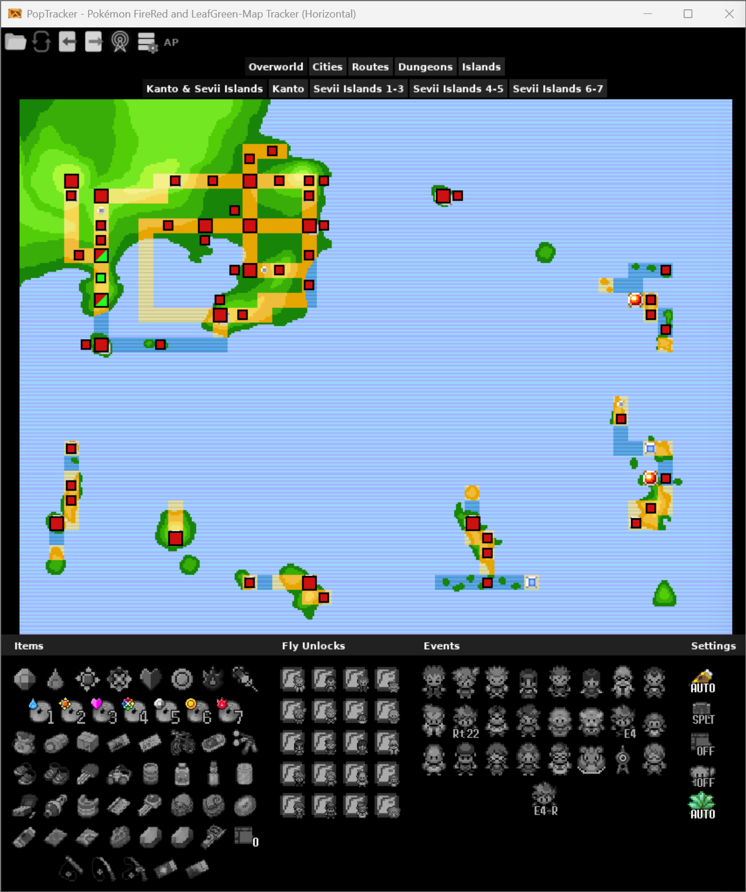
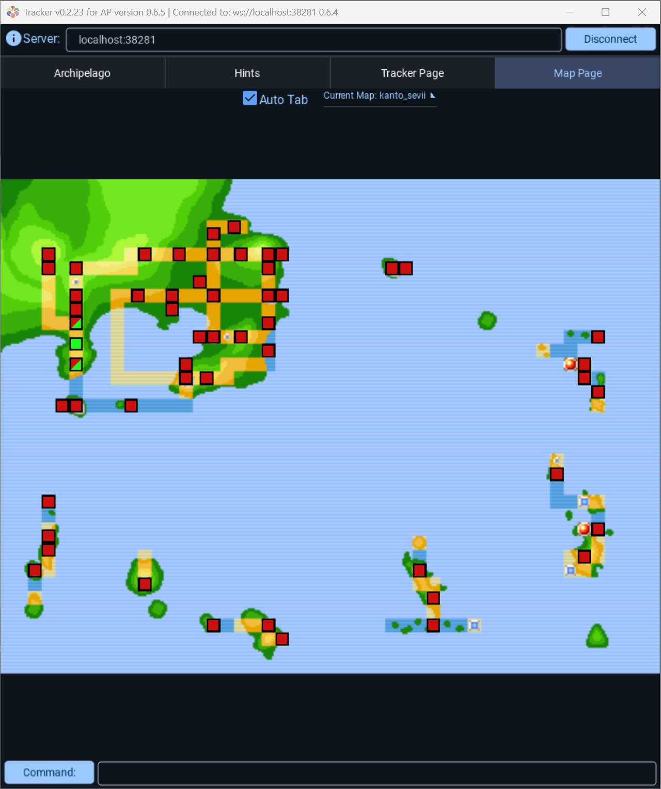

# Pokémon FireRed/LeafGreen Tracker

Pokémon FireRed/LeafGreen tracker pack for [PopTracker](https://github.com/black-sliver/PopTracker/) or [Universal Tracker](https://github.com/FarisTheAncient/Archipelago) with Autotracking.

| Poptracker | Universal Tracker |
|:----------:|:-----------------:|
|  |  |

# Overview

This tracker pack can be utilized by both PopTracker and Universal Tracker. You can use whichever program you prefer, however a full list of features that each supports is detailed below.

## PopTracker
- Item grids that display items, fly unlocks, events, and Pokémon that are logically relevant in the randomizer
- Map area that displays all relevant maps in the randomizer with colored sqaures for all check locations, events, wild encounters, and static Pokémon that conveys whether they are accessible
  - Split map mode that allows you to see the overworld map and current area map at the same time
- Three different display variants: Horizontal Map Tracker, Vertical Map Tracker, and Items Only Tracker
- Settings popup in order to set all the settings for your current randomizer seed
- Supports most settings of the randomizer
  - Does not currently support entrance randomization other than shuffled dungeons
- Autotracking capability
  - Tracks items, fly unlocks, events, and Pokémon that are obtained/received
  - Tracks check locations that are collected
  - Toggle option for whether the map area will auto tab when changing maps in game
  - Toggle option for whether wild encounter and static Pokémon locations will be autotracked
    - When turned on, these locations will be marked as checked once the Pokémon at them has been registered as seen in you Pokédex if they are not a Dexsanity check or been registered as caught when they are a Dexsanity check
  - Tracks randomized fly destinations once the fly unlock has been obtained/received
  - Tracks dungeon entrances that have been checked

## Universal Tracker
- List of all locations and entrances that are currently accessible
- Map area that displays relevant maps in the randomizer with colored sqaures for all check locations and entrances that conveys whether they are accessible
- Autotracking capability
  - Tracks items that are obtained/received
  - Tracks events as completed as soon as they are logically accessible
    - Includes fly unlocks if fly unlocks are not shuffled
    - Includes Pokémon from wild encounters and static Pokémon locations
  - Tracks check locations that are collected
  - Toggle option for whether the map area will auto tab when changing maps in game
  - Tracks entrances that have been checked if `enforce_deferred_entrances` is set to either `default` or `on` in your `host.yaml`, otherwise entrances are shown as checked as soon as they are logically accessible

# Compatibility Chart
| Apworld Version | Pack Version  |
|:---------------:|:-------------:|
|      1.0.0      |     4.0.0     |
|  0.9.4 - 0.9.6  |     3.0.0     |
|  0.9.1 - 0.9.3  | 2.0.0 - 2.1.0 |
|      0.8.7      |     1.7.0     |
|  0.8.5 - 0.8.6  |     1.6.4     |
|      0.8.4      |     1.6.3     |
|      0.8.3      |     1.6.2     |
|  0.8.0 - 0.8.2  | 1.6.0 - 1.6.1 |
|  0.7.0 - 0.7.3  | 1.5.0 - 1.5.1 |

# Credits
The badge sprites are from [www.deviantart.com](https://www.deviantart.com/jcferggy/art/16x16-Pokemon-Badge-Sprites-Gen-1-6-544204402) created by JcFerggy.